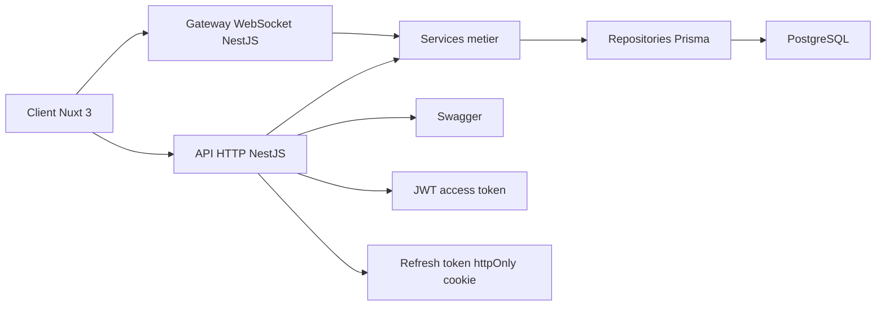
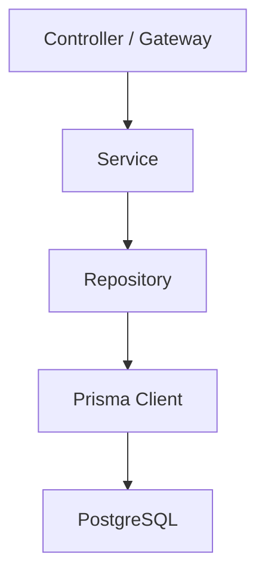
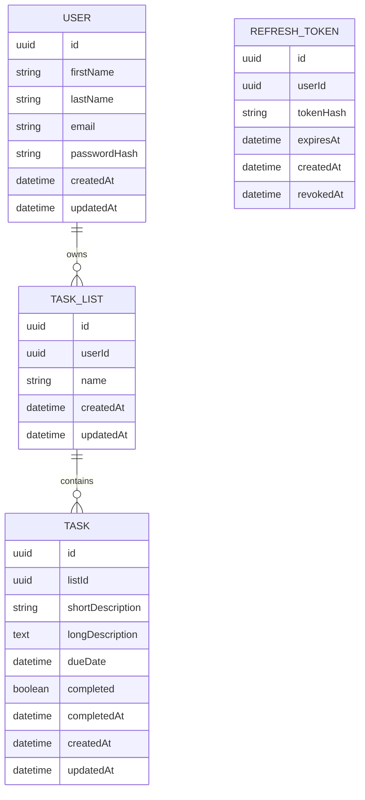

## 1. Design d'architecture



## 2. Description technologique

- Front-end : `Nuxt 3` + `Vue 3` + `TypeScript` + `Pinia` + `Tailwind CSS` + `socket.io-client`
- Back-end : `NestJS` + `TypeScript` + `Prisma` + `PostgreSQL` + `Socket.IO`
- Authentification : `JWT` avec access token court et refresh token long en cookie `httpOnly`
- Documentation : `Swagger`
- Tests : `Jest` pour l'unitaire et `NestJS e2e`
- Monorepo : `pnpm workspaces`
- Conteneurisation : `Docker` + `docker compose`

## 3. Définition des routes front

| Route | Rôle |
|-------|------|
| `/login` | Connexion et inscription utilisateur |
| `/` | Page principale protégée affichant listes, tâches et détail |

## 4. Définitions API

### 4.1 Contrats TypeScript principaux

```ts
export type AuthUser = {
  id: string;
  firstName: string;
  lastName: string;
  email: string;
};

export type TaskList = {
  id: string;
  name: string;
  userId: string;
  createdAt: string;
};

export type TaskItem = {
  id: string;
  listId: string;
  shortDescription: string;
  longDescription: string | null;
  dueDate: string;
  completed: boolean;
  createdAt: string;
  updatedAt: string;
};
```

### 4.2 Endpoints HTTP

| Méthode | Route | Description |
|---------|-------|-------------|
| `POST` | `/auth/register` | Crée un compte utilisateur |
| `POST` | `/auth/login` | Authentifie l'utilisateur et crée la session |
| `POST` | `/auth/refresh` | Renouvelle l'access token via refresh token |
| `POST` | `/auth/logout` | Supprime la session et invalide le refresh token |
| `GET` | `/auth/me` | Retourne l'utilisateur connecté |
| `GET` | `/lists` | Retourne les listes de l'utilisateur connecté |
| `POST` | `/lists` | Crée une nouvelle liste avec nom unique par utilisateur |
| `DELETE` | `/lists/:id` | Supprime une liste et ses tâches |
| `GET` | `/lists/:id/tasks` | Retourne les tâches d'une liste appartenant à l'utilisateur |
| `POST` | `/tasks` | Crée une tâche |
| `PATCH` | `/tasks/:id` | Met à jour une tâche |
| `PATCH` | `/tasks/:id/complete` | Marque une tâche terminée ou active |
| `DELETE` | `/tasks/:id` | Supprime une tâche |

### 4.3 Schémas de requête principaux

```ts
export type RegisterRequest = {
  firstName: string;
  lastName: string;
  email: string;
  emailConfirmation: string;
  password: string;
  passwordConfirmation: string;
};

export type CreateListRequest = {
  name: string;
};

export type CreateTaskRequest = {
  listId: string;
  shortDescription: string;
  longDescription?: string;
  dueDate: string;
};
```

## 5. Diagramme d'architecture serveur



## 6. Modèle de données

### 6.1 Définition du modèle



### 6.2 DDL cible

```sql
CREATE TABLE users (
  id UUID PRIMARY KEY,
  first_name VARCHAR(100) NOT NULL,
  last_name VARCHAR(100) NOT NULL,
  email VARCHAR(255) NOT NULL UNIQUE,
  password_hash VARCHAR(255) NOT NULL,
  created_at TIMESTAMP NOT NULL DEFAULT NOW(),
  updated_at TIMESTAMP NOT NULL DEFAULT NOW()
);

CREATE TABLE task_lists (
  id UUID PRIMARY KEY,
  user_id UUID NOT NULL REFERENCES users(id) ON DELETE CASCADE,
  name VARCHAR(120) NOT NULL,
  created_at TIMESTAMP NOT NULL DEFAULT NOW(),
  updated_at TIMESTAMP NOT NULL DEFAULT NOW(),
  CONSTRAINT task_lists_user_id_name_key UNIQUE (user_id, name)
);

CREATE TABLE tasks (
  id UUID PRIMARY KEY,
  list_id UUID NOT NULL REFERENCES task_lists(id) ON DELETE CASCADE,
  short_description VARCHAR(255) NOT NULL,
  long_description TEXT,
  due_date TIMESTAMP NOT NULL,
  completed BOOLEAN NOT NULL DEFAULT FALSE,
  completed_at TIMESTAMP NULL,
  created_at TIMESTAMP NOT NULL DEFAULT NOW(),
  updated_at TIMESTAMP NOT NULL DEFAULT NOW()
);

CREATE TABLE refresh_tokens (
  id UUID PRIMARY KEY,
  user_id UUID NOT NULL REFERENCES users(id) ON DELETE CASCADE,
  token_hash VARCHAR(255) NOT NULL,
  expires_at TIMESTAMP NOT NULL,
  created_at TIMESTAMP NOT NULL DEFAULT NOW(),
  revoked_at TIMESTAMP NULL
);

CREATE INDEX idx_task_lists_user_id ON task_lists(user_id);
CREATE INDEX idx_tasks_list_id ON tasks(list_id);
CREATE INDEX idx_refresh_tokens_user_id ON refresh_tokens(user_id);
```

## 7. Architecture du monorepo

```text
todo-app/
├── apps/
│   ├── api/
│   └── web/
├── packages/
│   ├── config/
│   └── shared-types/
├── docker-compose.yml
├── pnpm-workspace.yaml
└── package.json
```

## 8. Principes d'implémentation

- Isolation stricte des données par `userId` dans les services NestJS
- Validation systématique via DTOs et `class-validator`
- Gestion centralisée des erreurs avec filtres d'exception
- Store `Pinia` mis à jour directement sur événements WebSocket
- Aucune connexion WebSocket anonyme autorisée
- Dockerisation de chaque application et orchestration locale par `docker compose`
