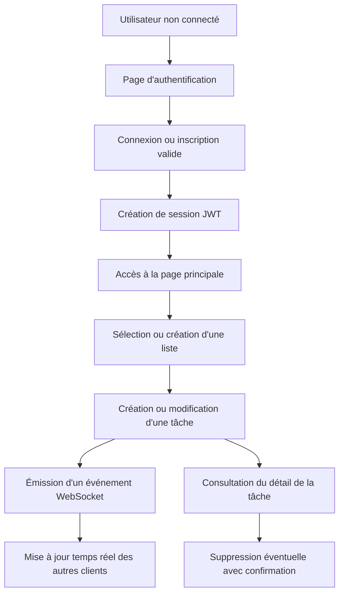

## 1. Vue d'ensemble du produit

Application web de gestion de tâches inspirée de Wunderlist et Google Tasks, conçue pour permettre à un utilisateur authentifié de gérer plusieurs listes et leurs tâches en temps réel.

- Le produit cible des professionnels ayant besoin d'un outil simple, rapide et fiable pour organiser leur travail quotidien.
- La valeur principale repose sur une expérience fluide, sécurisée, temps réel et bien structurée techniquement.

## 2. Fonctionnalités coeur

### 2.1 Rôles utilisateur

| Rôle | Mode d'inscription | Permissions coeur |
|------|--------------------|-------------------|
| Utilisateur | Inscription par email | Gérer uniquement ses propres listes et tâches |

### 2.2 Modules fonctionnels

1. **Page d'authentification** : connexion, création de compte, gestion des erreurs de session
2. **Page principale** : navigation entre listes, affichage des tâches, détail d'une tâche

### 2.3 Détail des pages

| Nom de page | Module | Description fonctionnelle |
|-------------|--------|---------------------------|
| Authentification | Formulaire de connexion | Permet à un utilisateur existant de se connecter via email et mot de passe |
| Authentification | Formulaire d'inscription | Permet de créer un compte avec nom, prénom, email + confirmation et mot de passe + confirmation |
| Authentification | Gestion de session | Gère le refresh transparent, les erreurs 401 et la redirection vers la connexion |
| Page principale | Left sidebar | Affiche les listes de l'utilisateur, permet la création, la sélection et la suppression avec confirmation |
| Page principale | Main content | Affiche les tâches de la liste sélectionnée, permet la création, la mise à jour de statut et l'affichage des tâches terminées |
| Page principale | Right sidebar | Affiche le détail complet de la tâche sélectionnée avec suppression confirmée |
| Page principale | Synchronisation temps réel | Répercute toutes les actions liées à une liste sur tous les clients connectés sans rechargement |

## 3. Processus coeur

Le flux principal commence par l'authentification de l'utilisateur. Une fois connecté, l'utilisateur accède à sa page principale, sélectionne ou crée une liste, ajoute des tâches, change leur statut et consulte le détail d'une tâche. Toutes les modifications réalisées sur une liste sont diffusées en temps réel à tous les onglets ou clients connectés à cette même liste.

## 4. Design de l'interface utilisateur

### 4.1 Style visuel

- Couleurs principales : fond neutre chaud, accent bleu profond, accent secondaire vert doux pour les états terminés
- Style des boutons : arrondis moyens, sobres, états hover/active clairs
- Typographie : hiérarchie sobre, lisible et professionnelle, avec une police d'interface moderne
- Mise en page : desktop-first en trois colonnes, avec sidebars fixes ou semi-fixes
- Icônes : style linéaire simple, cohérent avec un outil métier moderne

### 4.2 Vue d'ensemble des pages

| Nom de page | Module | Éléments UI |
|-------------|--------|-------------|
| Authentification | Carte centrale | Formulaire, titres, messages d'erreur, alternance connexion / inscription |
| Page principale | Left sidebar | Liste des listes, bouton de création, état sélectionné, actions de suppression |
| Page principale | Main content | En-tête de liste, formulaire de tâche, liste active, accordéon des tâches terminées |
| Page principale | Right sidebar | Métadonnées de tâche, descriptions, date de création, bouton de suppression |
| Global | Modales | Confirmation de suppression de liste et de tâche |

### 4.3 Responsive

- Approche desktop-first pour coller au besoin métier
- Adaptation tablette avec sidebars compressées
- Adaptation mobile avec panneaux repliables et priorité au contenu principal
- Zones cliquables confortables et navigation claire

### 4.4 Principes UX

- Minimiser les rechargements et les changements de contexte
- Garder les actions critiques visibles mais confirmées par modale
- Rendre l'état sélectionné, l'état terminé et l'état en erreur immédiatement compréhensibles
- Assurer une sensation de continuité grâce au temps réel et au refresh transparent de session
